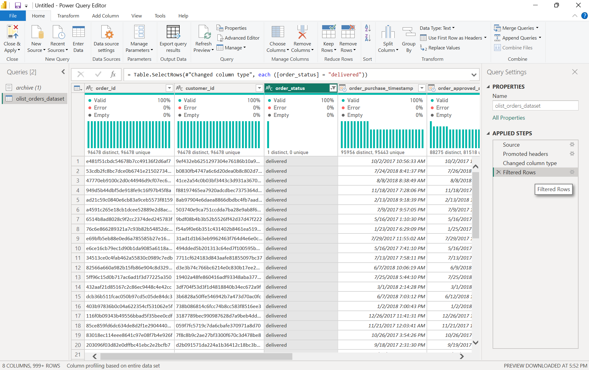
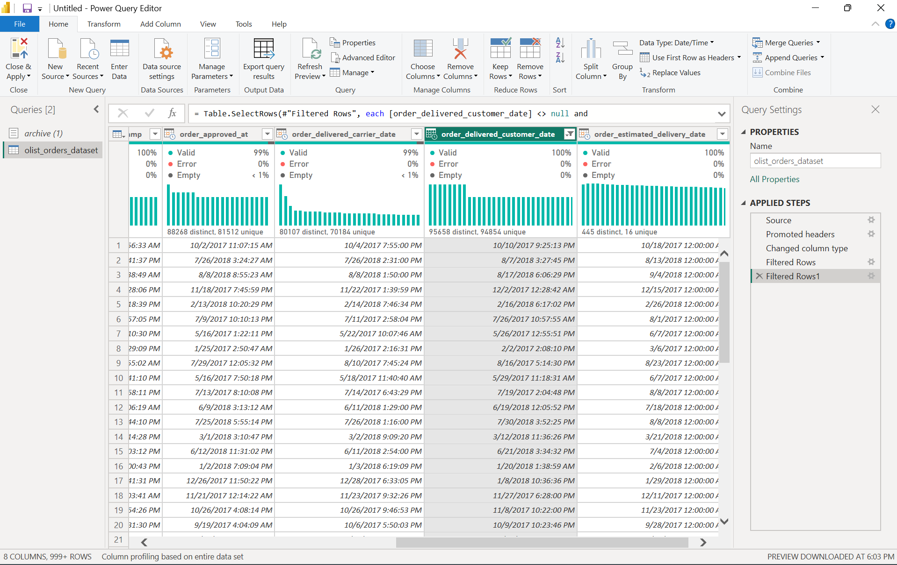
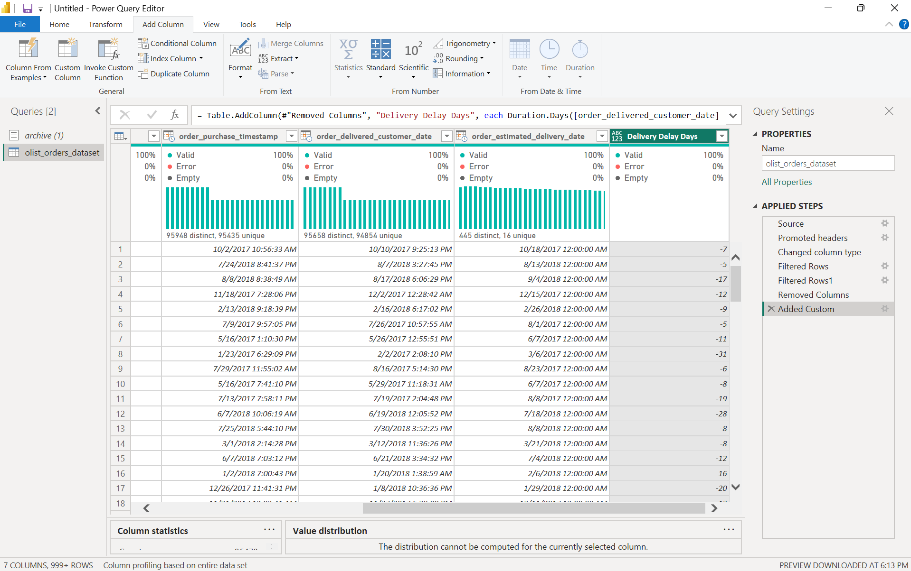
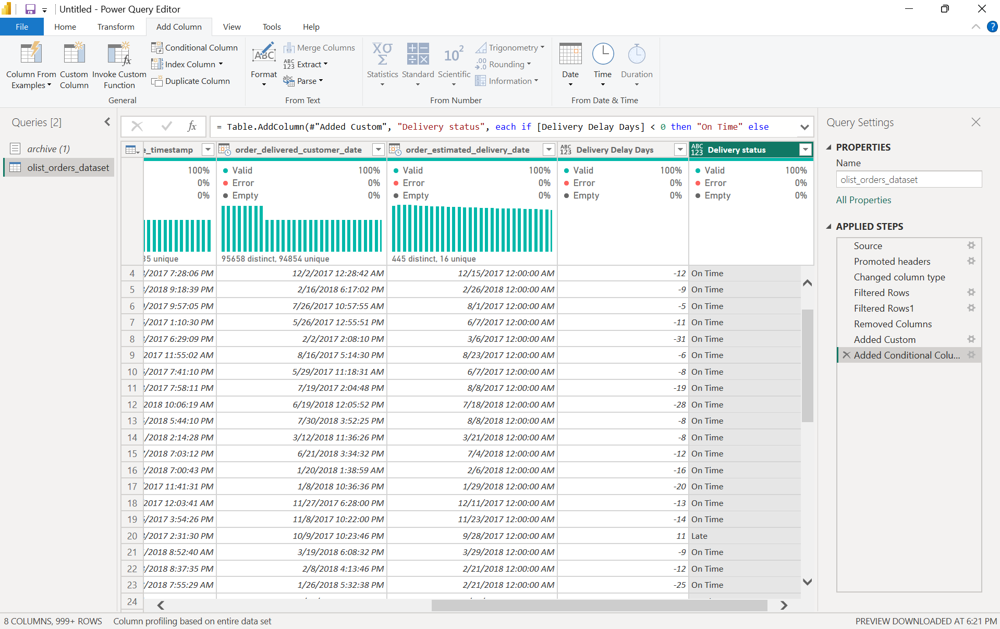
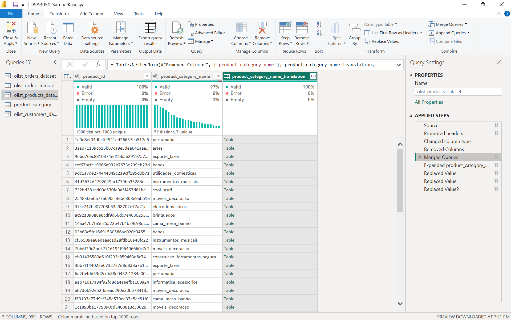
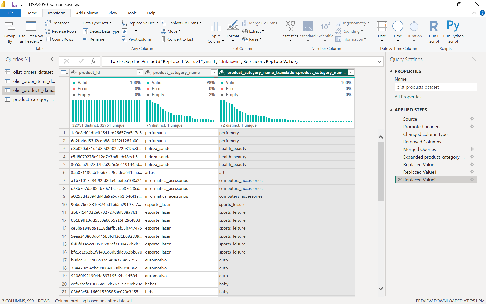
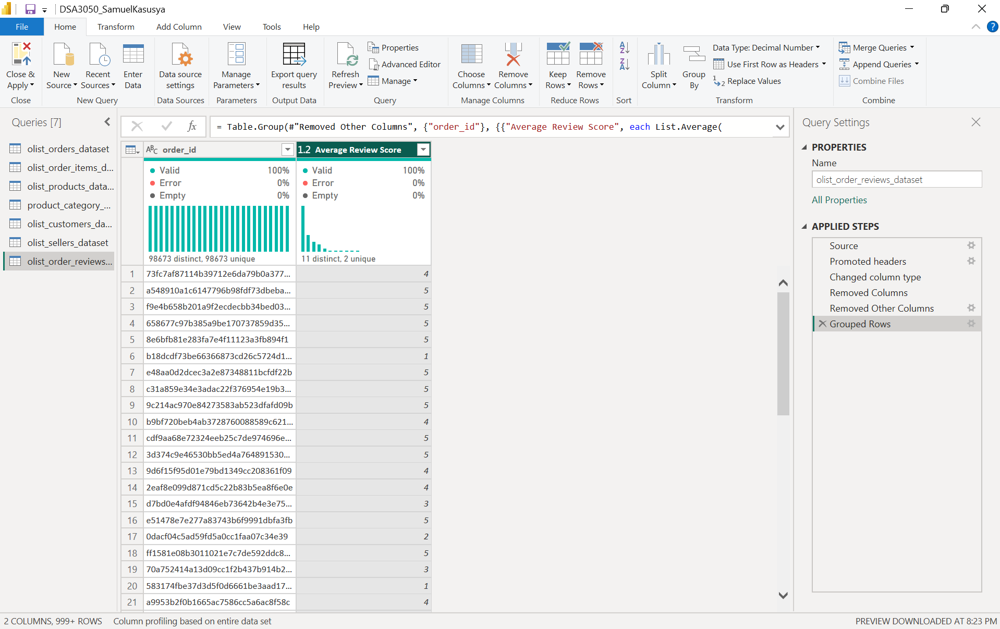
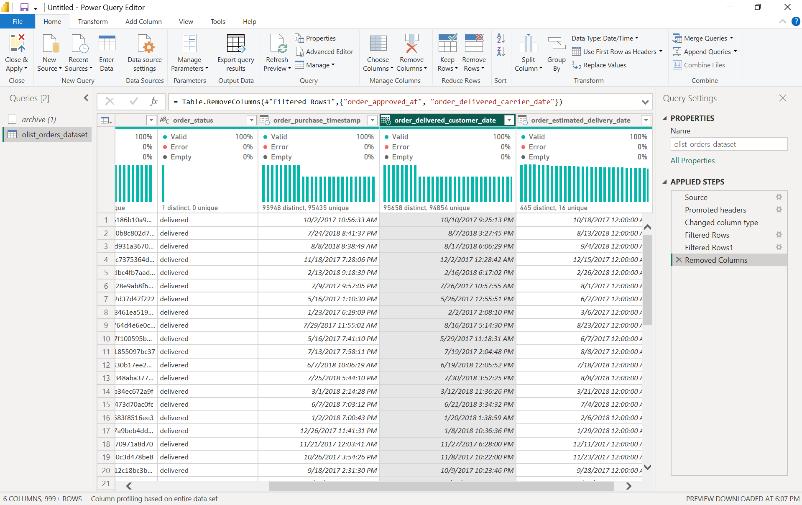
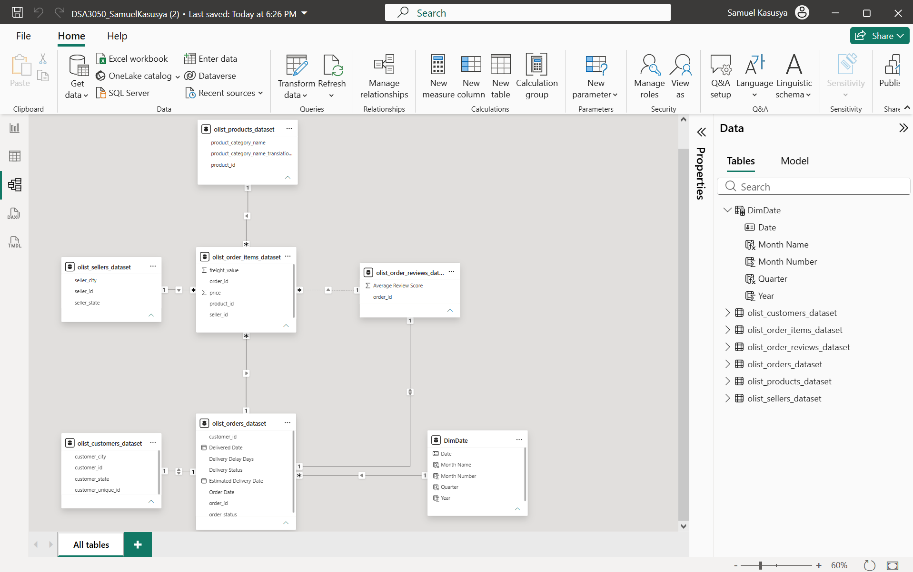

# DSA3050-PowerBI-SamuelKasusya-668694
# DSA3050 Business Intelligence & Data Visualisation — End Semester Examination

**Name:** Samuel Mwanzia Kasusya  
**Registration Number:** 668694  
**Dataset:** Brazilian E-Commerce Public Dataset by Olist

---

## Section A: Dataset Selection & Understanding

### 1. Dataset Source

Brazilian E-Commerce Public Dataset by Olist, published by Olist on Kaggle.

Source: https://www.kaggle.com/datasets/olistbr/brazilian-ecommerce

Olist is a Brazilian e-commerce platform that connects small and medium sellers to large online marketplaces. The company released this dataset publicly. It covers real orders placed on the platform between September 2016 and October 2018, with customer and seller identifiers anonymised.

### 2. What the Dataset Represents

The dataset contains 99,441 orders spread across nine related CSV files rather than a single flat table. Each file covers a different part of the transaction.

| File | Rows | Columns | Contents |
|---|---|---|---|
| olist_orders_dataset | 99,441 | 8 | One row per order, with status and four timestamps |
| olist_order_items_dataset | 112,650 | 7 | One row per item within an order, with price and freight |
| olist_order_payments_dataset | 103,886 | 5 | Payment method, instalments and value |
| olist_order_reviews_dataset | 99,224 | 7 | Review score and comments per order |
| olist_customers_dataset | 99,441 | 5 | Customer keys, city, state and zip prefix |
| olist_products_dataset | 32,951 | 9 | Category, dimensions and weight |
| olist_sellers_dataset | 3,095 | 4 | Seller location |
| product_category_name_translation | 71 | 2 | Portuguese to English category names |
| olist_geolocation_dataset | 1,000,163 | 5 | Zip prefix coordinates (excluded, see below) |

### 3. Why I Selected It

It is real transactional data released by the company itself, not a simulated or generated file, and the source is verifiable.

It arrives as *9* related tables rather than one flat file, so the data already has a natural fact and dimension structure. This supports proper dimensional modelling instead of forcing a star schema onto a single table.

At 99,441 orders and 112,650 order items it comfortably exceeds the 20,000 record minimum.

The geolocation table was *excluded* from the model. The customers table already carries city and state, which answers the geographic questions, and geolocation adds a million rows with heavy duplication and no analytical gain.

### 4. Main Variables

**Numerical:** price, freight_value, payment_value, payment_installments, review_score, product_weight_g, product dimensions.

**Categorical:** order_status, payment_type, product_category_name, customer_state, customer_city, seller_state.

**Date and time:** order_purchase_timestamp, order_approved_at, order_delivered_carrier_date, order_delivered_customer_date, order_estimated_delivery_date, review_creation_date.

**Keys:** order_id, customer_id, customer_unique_id, product_id, seller_id.

### 5. Business Problem

Olist does not control delivery itself. Orders are fulfilled by independent sellers and shipped through third party carriers, which means delivery performance varies and the platform carries the *reputational* cost when it goes wrong.

This project investigates delivery performance across the platform and whether it affects customer satisfaction. The dataset gives both an estimated delivery date and an actual delivery date for each order, alongside a customer review score, so it is possible to measure how often the platform misses its own delivery promise and then test whether missing it damages the *review score*.

The practical question for management is where to intervene. If late deliveries are concentrated in particular states, categories or sellers, and if lateness measurably lowers review scores, then those are the areas worth fixing first.

### 6. Analytical Questions

1. How have order volume and revenue changed over the period covered, and which product categories contribute most to revenue?
2. Which states account for the most orders and revenue, and how is the customer base distributed geographically?
3. How long do deliveries actually take compared with the estimated delivery date, and what proportion of orders arrive late?
4. Do late deliveries receive lower review scores than on time deliveries?
5. Which product categories and seller states have the worst delivery performance, and how much revenue is

### Section A additions — Dataset limitations

Filtering to delivered orders (see Section B) means cancellations are excluded from the analysis, so this model cannot report a cancellation rate. Removing the seller-handover and carrier-pickup timestamps also means lateness cannot be attributed to the seller versus the carrier. These are acceptable given the business problem focuses on delivery outcome and its effect on satisfaction, but they define the boundary of what the solution can answer.

Before finalising the analytical questions, question 5 was checked against the raw data to confirm seller *state* varies in late-delivery rate (it ranges from about 6% to over 20% across states), so the question is answerable rather than assumed.

---

## Section B: Power Query — Data Cleaning & Transformation

The following eight transformations are documented in Problem → Transformation → Reason → Result form. Additional supporting steps (type corrections, renames, column removals) were also applied across the six tables.

### 1. Filter orders to delivered status only
**Problem:** The orders table contained 99,441 orders across eight statuses, including canceled, shipped, unavailable and processing. Non-delivered orders have no actual delivery date.
**Transformation:** Filtered the order_status column to keep only "delivered".
**Reason:** The business problem is about delivery performance and its effect on reviews. An order that was never delivered has no delivery experience to measure or rate, and would sit in the data as a blank that distorts delivery averages.
**Result:** 96,478 delivered orders remain, each with a complete purchase-to-delivery lifecycle.

### 2. Remove delivered orders with no delivery date
**Problem:** A small number of orders were marked "delivered" but had no recorded delivery date, a source data inconsistency.
**Transformation:** Removed rows where order_delivered_customer_date was empty.
**Reason:** Every delivery calculation depends on this date being present. Leaving nulls in would silently break averages and subtractions.
**Result:** All remaining orders have a valid delivery date; the column profiles as 100% valid.

### 3. Create Delivery Delay Days (custom column)
**Problem:** The data implied whether an order was late through two separate date columns but did not state the delay directly.
**Transformation:** Added a custom column, Delivery Delay Days, calculated as Duration.Days between the actual delivery date and the estimated delivery date.
**Reason:** A single per-order delay value is needed to filter, group and analyse delivery performance. A positive value means the order arrived after the promised date; negative means early.
**Result:** Each order carries a delay figure ranging from about -51 (very early) to +49 (very late).

### 4. Create Delivery Status flag (conditional column)
**Problem:** The raw delay number is precise but not directly usable for grouping orders into late versus on-time.
**Transformation:** Added a conditional column, Delivery Status: if Delivery Delay Days is greater than 0 then "Late", otherwise "On Time".
**Reason:** Analytical question 4 asks whether late deliveries receive lower reviews, which requires every order tagged as Late or On Time. Orders arriving exactly on the estimated day are treated as On Time, since they did not breach the promise.
**Result:** Every order is classified, with roughly 8% Late and 92% On Time.

### 5. Merge English category names (merge queries)
**Problem:** Product categories were in Portuguese, which is not suitable for a report intended for an English-reading audience.
**Transformation:** Merged the products table with the category translation table on product_category_name using a Left Outer join, then expanded the English name column.
**Reason:** A Left Outer join keeps every product and adds the English name where a match exists, rather than dropping unmatched products. This preserves all data and exposes categories with no translation instead of hiding them.
**Result:** Products now carry an English category name; unmatched categories surface as null for separate handling.

### 6. Handle missing product categories
**Problem:** After the merge, about 2% of products had no category — 610 with no original Portuguese category and 2 with no available English translation.
**Transformation:** Replaced the null English category values with "Unknown".
**Reason:** These products still generated real orders and revenue. Removing them would understate totals, whereas labelling them "Unknown" keeps them in the analysis as a visible, honest category.
**Result:** No null categories remain; every product is assigned a category, real or "Unknown".

### 7. Group reviews to one score per order (group by)
**Problem:** The reviews table had 99,224 reviews but only 98,673 distinct order_ids — 551 orders had more than one review, which would double-count those orders in any average.
**Transformation:** Grouped the reviews table by order_id and aggregated review_score as an Average.
**Reason:** Analytical question 4 needs one representative score per order so each order counts once. Averaging multiple reviews fairly captures a mixed experience.
**Result:** 98,673 rows, one average review score per order, ready for a clean one-to-one link to orders.

### 8. Remove unnecessary columns across tables
**Problem:** Several tables carried columns irrelevant to the business problem: zip code prefixes, intermediate order timestamps, product listing metadata, and review comment text.
**Transformation:** Removed these columns from the orders, customers, sellers, products and reviews tables.
**Reason:** None of the five analytical questions use these fields. A leaner model is easier to relate, faster, and simpler to reason about.
**Result:** Each table retains only the keys and attributes its analysis requires.

### Tables excluded from the model
- **Geolocation** (1,000,163 rows): excluded because customers and sellers already carry city and state, and the table adds heavy duplication and no analytical gain.
- **Order payments**: assessed and excluded because no analytical question uses payment method, instalments or value.

## Section C: Data Modelling

The cleaned tables were organised into a star schema rather than a single flat table, so that descriptive dimensions filter a central fact table through clear one-to-many relationships.

### Fact table
**olist_order_items_dataset** is the fact table. It sits at the centre of the model and holds the transactional measures, price and freight value, the grain of one row per item within an order. Every other table relates into it on the "one" side, making it the natural fact.

### Dimension tables
- **olist_orders_dataset** provides order-level attributes: order date, delivery dates, delivery delay and delivery status. It links to order_items on order_id.
- **olist_products_dataset** provides the product category (in English, merged from the translation table). It links to order_items on product_id.
- **olist_sellers_dataset** provides seller city and state. It links to order_items on seller_id.
- **olist_customers_dataset** provides customer city and state. It links to orders on customer_id.
- **olist_order_reviews_dataset** provides the average review score per order. It links to orders on order_id.
- **DimDate** is a dedicated date table covering every day from 2016 to 2018. It links to orders on Order Date and drives all time-based analysis.

### Relationships and cardinality
Most relationships are one-to-many, with the dimension on the "one" side and order_items or orders on the "many" side. 

Two relationships are one-to-one. Reviews to orders is one-to-one because the reviews table was grouped to a single average score per order during Power Query. Customers to orders is one-to-one because of how the source defines customer_id.

### The customer key nuance
customer_id is defined at the order level, the source generates a new customer_id for every order, which is why customers relates to orders one-to-one. The column that identifies an actual person across multiple orders is customer_unique_id. Because none of the five analytical questions require counting distinct individuals, the one-to-one relationship does not disrupt any insight. Where a true customer count is ever needed, it would use a distinct count of customer_unique_id rather than a row count.

### Date table
DimDate was created with the DAX CALENDAR function, range: 2016 to 2018 and given Year, Quarter, Month Number and Month Name columns. Month Name is sorted by Month Number so chart axes order correctly. The table was formally marked as a date table so that time intelligence functions behave correctly. It relates to orders on Order Date, which is the primary business date. The orders table also holds delivered and estimated delivery dates, but a date table can only relate to one column, and order date is the natural axis for trend and year-on-year analysis.

### Filter direction
All relationships use single-direction cross-filtering, flowing from the dimensions into the fact. Bidirectional filtering was avoided to prevent ambiguous filter paths.

### Modelling decisions and challenges
- The product category translation table was set to not load into the model, because its English column was already merged into the products table during Power Query. This avoids a redundant, disconnected table.
- The geolocation table was excluded entirely, as customer and seller state already provide the geography needed, and geolocation would have added a million duplicated rows and an ambiguous relationship path.
- Two grains coexist in the model: order_items is per item (for revenue) while orders is per order (for delivery performance). These relate cleanly on order_id, so both item-level and order-level analysis are possible from one model.
